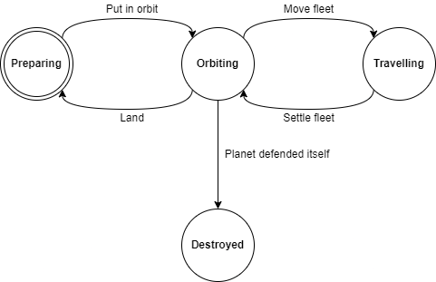

# Fleets

Fleets are groups of [ships](ships.md) and have statistics that are a function of all the ships composing the fleet.

They are useful because they allow a commander to move several ships at once, instead of interacting with ships individually.

# Fleet status

There are currently several status a fleet can have and their relationships are shown in the following graph:

- **Preparing**. The fleet is landed on a planet. It can modify its composition by adding and removing ships from the fleet and it can also load and unload resources. The fleet is protected and cannot be attacked by ennemy fleets while it's preparing. The fleet's statistics also count toward planetary defense as explained in the [plundering module's documentation](plundering.md). The fleet cannot travel while it's preparing.
- **Orbitting**. The fleet leaves the planet surface to reach an orbit. The fleet can now be attacked by ennemy fleets. The fleet can still load/unload resources but can no longer change the composition of the fleet. The fleet's statistics no longer count toward planetary defense. The fleet can travel from its planet to anywhere else in the cosmos. Only the controller of both the fleet and the planet can land a fleet.
- **Travelling**. The fleet started travelling. Nobody can interact with it until it reach its destination. Once reached, the controller of the fleet can settle the fleet, making it enter an orbit around destination planet.
- **Destroyed**. The fleet has been destroyed by another fleet or a planet is was orbitting on. It's over for it.